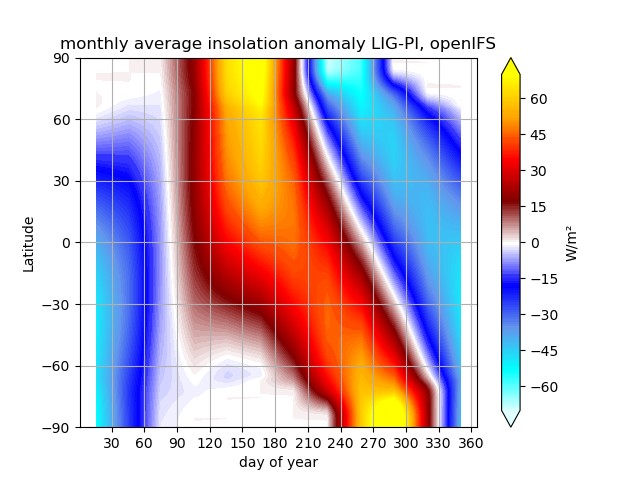

.. _how_to

How to
******

Cite this model
=========

Streffing, J., Sidorenko, D., Semmler, T., Zampieri, L., Scholz, P., Andres-Martinez, M., . . . Jung, T. (2022). AWI-CM3 coupled climate model: description and evaluation experiments for a prototype post-CMIP6 model. Geoscientific Model Development, 15 (16), 6399–6427. Retrieved from https://gmd.copernicus.org/articles/15/6399/2022/ doi: 10.5194/gmd-15-6399-2022

Measure which component is limiting the throughput of the coupled model
=========

Coupled performance balancing can be performed with the oasis lucia tool. In the work folder where your experiment ran, execute ``$(model_install_dir)/awicm-3.1/oasis/util/lucia/lucia``. When executing lucia for the first time, a fortran compiler needs to be available in the environment. 
The output,
   
..  code-block:: bash
  
  Component -         Calculations   -     Waiting time (s) - # cpl step :
  fesom                    1616.47                 45.08          4377
  oifs                     1263.30                397.72          4377
 
..
  
can be interpreted as such. Fesom spend nearly all it's computing time on calculations, while oifs was waiting for about 1/4 of the time. Therefore fesom was the   limiting factor on this specific setup. Take note, that having zero waiting time in all components is no achievable, since the length of timesteps varies throughout the run, depending on output and called physics packages. For example the radiation is called every 2 hours in OpenIFS making this timesteps longer than the non-radiation ones in between. Modern versions of lucia also provide solutions for optimizing with this imbalance in mind.

Generate OASIS3MCT remapping weights for large grids (offline and MPI+OMP parallel)
=========

Before you start, make sure that you:
 
- Obtain the FESOM2 mesh and generate the mesh distribution you would like to use.
- Use the `ocp-tool <https://github.com/AWI-ESM/ocp-tool2/>`_  to match the FESOM2 mesh to the atmosphere files (really just means cutting caspian out of the OIFS land sea mask)
- Copy the ocp-tool modified OpenIFS input files, as well as the Oasis input files (areas.nc, grids.nc, masks.nc) and the runoff_mapper input files into the sub-directories of the pool dir that you use.

Steps towards the ``rmp_`` files:

- Generate FESOM2 mesh description file with `SpheRlab <https://github.com/FESOM/spheRlab>`_
- Link SpheRlab grid description file into ocp-tool2/fesom_mesh
- Link OpenIFS ICMGG????INIT files into ocp-tools2/openifs_input_default
- Run prep_fesom.sh
- Install / load ocp-tools conda environment
- Configure and run ocp_tool.py
- Copy files from ``ocp-tool2/output/oasis3_mct/input`` and ``ocp-tool2/output/openifs_input_modfied`` back into the pool directories
- Start a coupled simulation with the desired FESOM2 mesh ``dist``. OIFS ``nproc`` may be as small as minimum memory for loading the grid demands.
- Wait until the FESOM2 mesh information was added to the ``areas.nc, grids.nc, masks.nc`` files.
- Wait until the BICUBIC remapping files have been generated. (they are much fast than the GAUSWGT ones, and this will cut the manual work in half later)

For small meshes you can also wait for the GAUSWGT remapping files to be created. For large meshes follow the next steps. This method is meant for Atmosphere-Ocean grid combinations in excess of ~1*10^12, where automatic weight generation on single cores becomes prohibitively time consuming. 

- Cancel the job allocation since generating the GAUSWGT ``rmp_`` files would take days to months.
- Change the COUPLE path in ``awicm-3.1/oasis/util/make_dir/make.${your_config}_``
- Set the path to ${your_config} in ``awicm-3.1/oasis/util/make_dir/make.inc_``
- Go to ``awicm-3.1/oasis/examples/test_interpolation``
- Add your ``areas.nc, grids.nc, masks.nc`` files to ``awicm-3.1/oasis/examples/test_interpolation/data_frontiers``
- Modify the ``awicm-3.1/oasis/examples/test_interpolation/run_frontiersinterp.sh`` to add your machine, if it's not included already.
- Extract the ``GAUSWGT`` couplings (FESOM->OIFS) from the namcouple in your work folder where you generated the ``BICUBIC`` ``rmp_`` files.
- Create one namcouple for every remapping in direction at ``awicm-3.1/oasis/examples/test_interpolation/data_frontiers`` For an example, see: ``awicm-3.1/oasis/examples/test_interpolation/data_frontiers/namcouple_feom_A160_gauswgt``
- Configure `awicm-3.1/oasis/examples/test_interpolation/run_frontiersinterp.sh` to generate these remappings with MPI and OpenMP parallelization.
- Generate the GAUSWGT remappings by starting ``run_frontiersinterp.sh`` on the batch queue.
- Copy all ``rmp_`` files into the respective pool dir folder (e.g. ``input/oasis/cy43r3/{OIFS_RES}-${FESOM_RES}/${FESOM_DIST}``).
- Start a day long coupled simulation with oasis ``lresume=false`` to generate oasis restart files
- Copy oasis restart files into pool dir
- Start full speed simulation with oasis ``lresume=true`` to generate oasis restart files

Select an SSP or RCP scenario
=========
CMIP6
---------
Control is possible through the namelist file fort.4. Inside you will find the namelist NAERAD, which contains the options for CMIP5 and CMIP6 greenhouse gas forcing. To activate CMIP6 forcing set the logic switch ``LCMIP6 = .true.``. When NCMIPFIXYR is set to a value >0, it is interpreted as a fix forcing year. In the example below we use constant 1850 GHG forcing. If NCMIPFIXYR=0 the actual model year is used, and forcing changes from year to year. Note, that currently only greenhouse gases and solar radiation are set through this namelist. Work on the implementation of controllable anthopogenic aerosols is still ongoing (status: 30th of June 2022).

The recommended way to ensure the namelist changes are made conistently, is to use the `add_namelist_changes <https://esm-tools.readthedocs.io/en/latest/cookbook.html?highlight=add_namelist_changes#changing-namelist-entries-from-the-runscript>`_ from esm-tools.

.. code-block:: Fortran
   
   &NAERAD
      LCMIP6 = .true.
      CMIP6DATADIR = 'PATH_TO_CMIP6_POOL'
      NCMIPFIXYR = 1850
      SSPNAME = 'historical'
      
Historic forcing is available for the years 1850 to 2014.
      
.. code-block:: Fortran
   
   &NAERAD
      LCMIP6 = .true.
      CMIP6DATADIR = 'PATH_TO_CMIP6_POOL'
      NCMIPFIXYR = 0
      SSPNAME = 'historical'
      
Available SSPs are: ``SSP1-1.9``, ``SSP1-2.6``, ``SSP2-4.5``, ``SSP3-7.0``, ``SSP3-LowNTCF``, ``SSP4-3.4``, ``SSP4-6.0``, ``SSP4-6.0``, ``SSP5-3.4-OS``, ``SSP5-8.5``. Covered years are 2015 to 2100.

.. code-block:: Fortran
   
   &NAERAD
      LCMIP6 = .true.
      CMIP6DATADIR = 'PATH_TO_CMIP6_POOL'
      NCMIPFIXYR = 0
      SSPNAME = 'SSP3-7.0'

The model also supports one percent increase per year and sudden four times incease of CO2 experiments through the additional logic switches ``L1PCTCO2`` and ``LA4XCO2``. The base value from which the the increase starts is set via ``NCMIPFIXYR``.

.. code-block:: Fortran
   
   &NAERAD
      LCMIP6 = .true.
      CMIP6DATADIR = 'PATH_TO_CMIP6_POOL'
      NCMIPFIXYR = 1850
      SSPNAME = 'historical'
      L1PCTCO2 = 'true'
      
For a more detailed look at the use of these forcing consult the source code file ``src/ifs/climate/updrgas.F90``

CMIP5
--------
Control is analogous to CMIP6 but we use ``LCMIP5``, ``CMIP5DATADIR``, and ``NRCP`` instead. Avaiable RCP are: 

.. code-block:: Fortran

    SELECT CASE (NRCP)
    CASE (0)
      FILENAME='ghg_histo.txt'
    CASE (1)
      FILENAME='ghg_rcp3PD.txt'
    CASE (2)
      FILENAME='ghg_rcp45.txt'
    CASE (3)
      FILENAME='ghg_rcp60.txt'
    CASE (4)
      FILENAME='ghg_rcp85.txt'

For a more detailed look at the use of these forcing consult the source code file ``src/ifs/climate/updrgas.F90``

Control Aerosol Scaling (AWI-CM3 v3.2 and above)
=========
Aerosol Scaling is a feature only available in AWI-CM3 v3.2 and above. For older versions it is not implemented (effectively deactivated). It is controlled via the ``fort.4`` namelist parameter ``NAERANT_SCALE`` in the ``NAERAD`` namelist. By default it is set to ``1`` (activated). If activated, the default aerosol levels (which have an annual cycle that does not change over the years) are scaled according to the spatio-temporal field given in ``ifsdata/aerosol_scale_1850_2085_r2005.nc``. This is supposed to model the anthropogenic influence on aerosol levels over time. For running paleo-simulations one might want to deactivate this. This is best done via an entry in the esm-tools runscript:

.. code-block:: yaml

   oifs:
       add_namelist_changes:
           fort.4:
               NAERAD:
                   NAERANT_SCALE: 0

For a more detailed look, consult the source code files, e.g. ``src/ifs/phys_ec/su_aer_scalefactor.F90``

Change the number of vertical levels for pressure level output of OpenIFS
=========
Output in controlled via `XIOS <https://forge.ipsl.jussieu.fr/ioserver>`_. The pressure levels onto which the data is interpolated from model levels is set in ``axis_def.xml``. In principle two options exist. Changing the number of levels for all 3D pressue level output fields and changing the number of levels only for some output fields.

For all fields
---------

To change the number of layers for all 3D pressure level fields, in ``axis_def.xml`` in section ``<axis_group id="pl_axes" ...>``
modify ``n_glo="19"`` to the new number of layers, ``value="(0,18)`` to 0 nlayers-1 and subequently list the pressure levels in Pa.

For select fields
---------

For selective fitting, in the ``<axis id="pressure_levels_zoom"`` section, you can make a sub-selection of the levels previously defined in the ``<axis id="pressure_levels"`` section. In the existing example three layers are selected: ``<zoom_axis index="(0,2)[10 11 12]" />``. To write a field on this reduced vertical domain you have to define a new grid in ``grid_def.xml``, specifying as domain ``pressure_levels_zoom`` instead of ``pressure_levels``. With this new grid you go to ``file_def.xml`` and define a new file (copy paste from ``pressure level`` output to ``pressure level output zoom``, and select the new grid). Then you delete the variables that should not be written on all levels from the pressure level output and insert them at pressure level output zoom.

Control orbital parameters
=========

The orbital parameters (eccentricity, obliquity, and longitude of perihelion) can be controlled through the namelist ``NAMORB`` inside the ``fort.4`` file. For details of the implementation, consider looking at yomorb.F90 and su0phy.F90.  Controllable orbital parameters are turned on with the logic swtich: ``LCORBMD=true``, which is turned off by default. There are then three modes with which the orbital parameters can be controlled.

- Under ``ORBMODE=variable_year`` mode the orbital parameters are calculated according to Berger et al. 1978 for the current year of the simulation. This is the default. The calculation can be considered reliable within ~+-1 million years of the present.
- Under ``ORBMODE=fixed_year`` mode the orbital parameters are calculated according to Berger et al. 1978 for the fixed year set by the namelist variable ``ORBIY``. If you choose fixed year but set no year, the default is 1950.
- Under ``fixed_parameters`` you have manual control over the parameters ``ORBECCEN``, ``ORBOBLIQ`` and ``ORBMVELP``. If you choose fixed parameters but set no parameters, the default ones are for 1950.

Example for manual control:

.. code-block:: Fortran

   &NAMORB
      LCORBMD = true
      ORBMODE = 'fixed_parameters'
      ORBECCEN = 0.016715
      ORBOBLIQ = 23.4441
      ORBMVELP = 102.7
      

In order to have esm-tools create an openIFS namelist of that form one can adjust the simulation YAML. The following example would let openIFS compute top of the atmosphere insolation based on an LIG orbit whose parameters are as defined for PMIP4:

.. code-block:: yaml

   oifs:
       add_namelist_changes:
           fort.4:
               NAMORB:
                   LCORBMD: TRUE
                   ORBMODE: 'fixed_parameters'
                   ORBECCEN: 0.039378
                   ORBOBLIQ: 24.040
                   ORBMVELP: 275.41

The resulting anomaly of top of the atmosphere insolation shows the expected anomalies across latitudes over time:

Use debug flags
=========

In case your model setup produces a segmentation fault it can be helpful to compile and run the model with debug flags. These can be set separatly for different executables in the coupled system. Here we mostly point you towards the locations that need to be modified in order to use debug flags. A comprehensive overview on which flags might help can be found at: https://doku.lrz.de/comparison-of-compiler-options-intel-vs-pgi-vs-gcc-11481685.html#ComparisonofCompilerOptions(intelvs.pgivs.gcc)-Diagnostics,RuntimeCheckingandDebugging

OpenIFS cy43r3 (AWI-CM3 v3.2 and below)
--------
You can replace the OpenIFS Fortran compile and linker flags through esm_tools under ``esm_tools/configs/components/oifs/oifs.env.yaml`` by modifying ``OIFS_FFLAGS``. E.g:

.. code-block:: yaml

   oifs:
      compiletime_environment_changes:
         levante:
            add_export_vars:
               OIFS_FFLAGS: '"-r8 -fp-model precise -align array32byte -O3 -qopenmp -g -traceback -convert big_endian -march=core-avx2 -mtune=core-avx2"'

Make sure you pick the right HPC system and use flags that fit to the compiler which is being used (see compiletime log output).

OpenIFS cy48r1 (AWI-CM3 v3.3 and above)
--------
TBA.

for FESOM2
--------
For FESOM2 it is currenty neccessary to modify the compiler settings in the source code folder inside the file ``awicm3-v3.2/fesom-2.5/src/CMakeLists.txt``. The exact path my vary with your model version. You will find inside a block with different FORTRAN flags depending on compiler ``Inter/GNU/Cray/NVHPC``, on whether FESOM2 is build as a library or executable, and sometimes on HPC system:

.. code-block:: CMake

   if(${CMAKE_Fortran_COMPILER_ID} STREQUAL  Intel )
      if(${BUILD_FESOM_AS_LIBRARY})
           target_compile_options(${PROJECT_NAME} PRIVATE -r8 -i4 -fp-model precise -no-prec-div -no-prec-sqrt -fimf-use-svml -xHost -ip -init=zero -no-wrap-margin -fpe0) # add -fpe0 for RAPS environment
      else()
           target_compile_options(${PROJECT_NAME} PRIVATE -r8 -i4 -fp-model precise -no-prec-div -no-prec-sqrt -fimf-use-svml -ip -init=zero -no-wrap-margin)
      endif()
      if(${FESOM_PLATFORM_STRATEGY} STREQUAL  levante.dkrz.de )
         target_compile_options(${PROJECT_NAME} PRIVATE -march=core-avx2 -mtune=core-avx2)
      elseif(${FESOM_PLATFORM_STRATEGY} STREQUAL  albedo)
         target_compile_options(${PROJECT_NAME} PRIVATE -march=core-avx2 -O3 -ip -fPIC -qopt-malloc-options=2 -qopt-prefetch=5 -unroll-aggressive) #NEC mpi option
      else()
         target_compile_options(${PROJECT_NAME} PRIVATE -xHost)
      endif()
   #    target_compile_options(${PROJECT_NAME} PRIVATE -g -traceback ) #-check all,noarg_temp_created,bounds,uninit ) #-ftrapuv ) #-init=zero)
   #    target_compile_options(${PROJECT_NAME} PRIVATE -qopenmp -r8 -i4 -fp-model precise -no-prec-div -no-prec-sqrt -fimf-use-svml -xHost -ip -g -traceback -check all,noarg_temp_created,bounds,uninit ) #-ftrapuv ) #-init=zero)
   #    target_compile_options(${PROJECT_NAME} PRIVATE -r8 -i4 -fp-model precise -no-prec-div -no-prec-sqrt -fimf-use-svml -ip -g -traceback -check all,noarg_temp_created,bounds,uninit ) #-ftrapuv ) #-init=zero)
   
   elseif(${CMAKE_Fortran_COMPILER_ID} STREQUAL  GNU )
   #    target_compile_options(${PROJECT_NAME} PRIVATE -O3 -finit-local-zero  -finline-functions -fimplicit-none  -fdefault-real-8 -ffree-line-length-none)
      target_compile_options(${PROJECT_NAME} PRIVATE -O2 -g -ffloat-store -finit-local-zero  -finline-functions -fimplicit-none  -fdefault-real-8 -ffree-line-length-none)
      if(CMAKE_Fortran_COMPILER_VERSION VERSION_GREATER_EQUAL 10 )
         target_compile_options(${PROJECT_NAME} PRIVATE -fallow-argument-mismatch) # gfortran v10 is strict about erroneous API calls: "Rank mismatch between actual argument at (1) and actual argument at (2) (scalar and rank-1)"
      endif()
   elseif(${CMAKE_Fortran_COMPILER_ID} STREQUAL Cray )
      if(${ENABLE_OPENMP})
         target_compile_options(${PROJECT_NAME} PRIVATE -c -emf -hbyteswapio -hflex_mp=conservative -hfp1 -hadd_paren -Ounroll0 -hipa0 -r am -s real64 -N 1023 -homp)
      else()
         target_compile_options(${PROJECT_NAME} PRIVATE -c -emf -hbyteswapio -hflex_mp=conservative -hfp1 -hadd_paren -Ounroll0 -hipa0 -r am -s real64 -N 1023 -hnoomp)
      endif()
   elseif(${CMAKE_Fortran_COMPILER_ID} STREQUAL NVHPC )
      target_compile_definitions(${PROJECT_NAME} PRIVATE ENABLE_NVHPC_WORKAROUNDS)
      target_compile_options(${PROJECT_NAME} PRIVATE -fast -fastsse -O3 -Mallocatable=95 -Mr8 -pgf90libs)
      if(${ENABLE_OPENACC})
         # additional compiler settings
         target_compile_options(${PROJECT_NAME} PRIVATE -acc -ta=tesla:${NV_GPU_ARCH} -Minfo=accel)
         set(CMAKE_EXE_LINKER_FLAGS "-acc -ta=tesla:${NV_GPU_ARCH}")
      endif()
      if(${ENABLE_OPENMP})
         target_compile_options(${PROJECT_NAME} PRIVATE -Mipa=fast)
      else()
         target_compile_options(${PROJECT_NAME} PRIVATE -Mipa=fast,inline)
      endif()
   endif()

In order to change the compiler settings you replace the ``target_compile_options`` that are currently used with the ones that you would like to have. Make sure you pick the right HPC system and use flags that fit to the compiler which is being used (see compiletime log output). Typical debug flags for e.g. Intel would be ``-g -traceback -check all,noarg_temp_created,bounds,uninit``. 

for XIOS
--------

For the IO server debug flags can be set inside the xios source code folder at: ``awicm3-v3.2/xios/arch.fcm``. The exact path may vary by model version. Here you want to add some of the DEV and DEBUG flags to the BASE flags for Fortran or C, as appropriate:

.. code-block:: CMake

   %BASE_CFLAGS    -std=c++11 -diag-disable 1125 -diag-disable 279 -D__XIOS_EXCEPTION
   %PROD_CFLAGS    -O3 -D BOOST_DISABLE_ASSERTS -march=core-avx2 -mtune=core-avx2
   %DEV_CFLAGS     -g -traceback
   %DEBUG_CFLAGS   -DBZ_DEBUG -g -traceback -fno-inline
   
   %BASE_FFLAGS    -D__NONE__
   %PROD_FFLAGS    -O3 -march=core-avx2 -mtune=core-avx2
   %DEV_FFLAGS     -g -O2 -traceback
   %DEBUG_FFLAGS   -g -traceback
