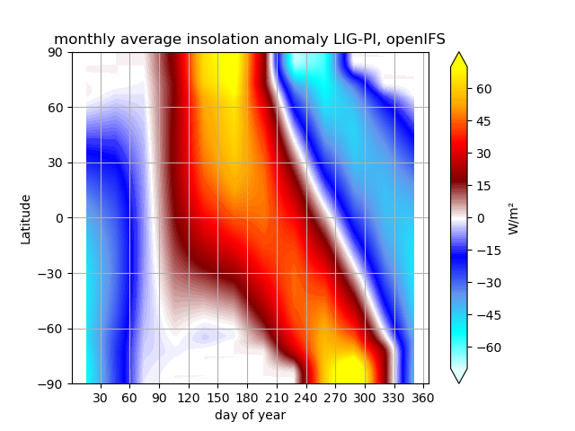
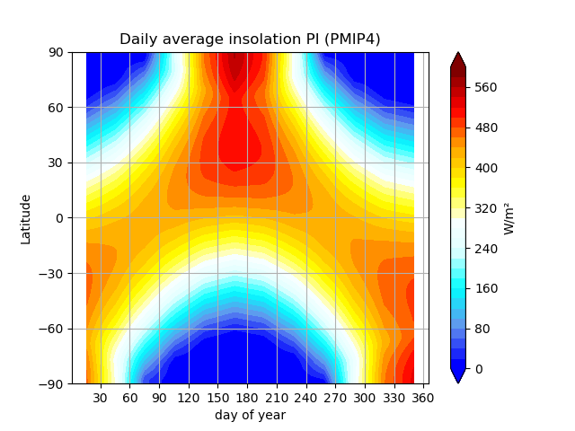
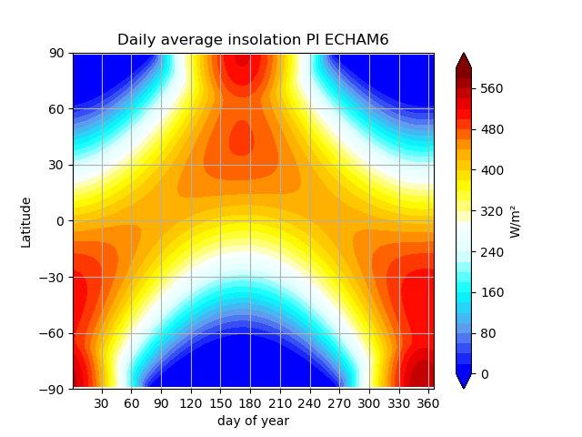
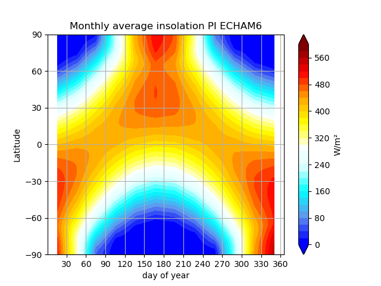
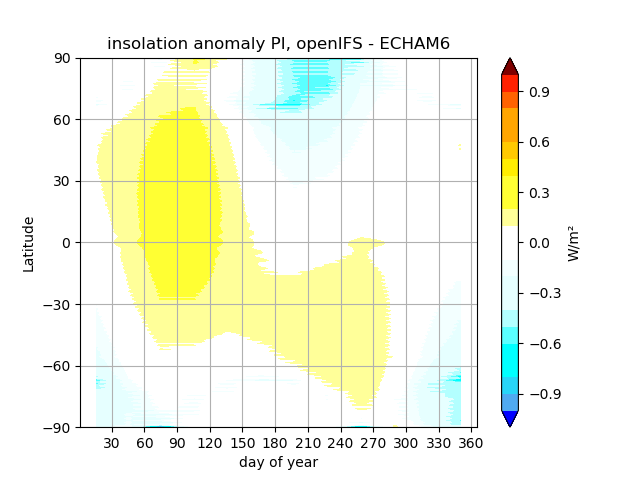

*****************
Forcing and orbit
*****************

Select an SSP or RCP scenario
=============================
CMIP6
-----
Control is possible through the namelist file fort.4. Inside you will find the namelist NAERAD, which contains the options for CMIP5 and CMIP6 greenhouse gas forcing. To activate CMIP6 forcing set the logic switch ``LCMIP6 = .true.``. When NCMIPFIXYR is set to a value >0, it is interpreted as a fix forcing year. In the example below we use constant 1850 GHG forcing. If NCMIPFIXYR=0 the actual model year is used, and forcing changes from year to year. Note, that only greenhouse gases and solar radiation are set through this namelist.

The recommended way to ensure the namelist changes are made conistently, is to use the `add_namelist_changes <https://esm-tools.readthedocs.io/en/latest/cookbook.html?highlight=add_namelist_changes#changing-namelist-entries-from-the-runscript>`_ from esm-tools.

.. code-block:: Fortran
   
   &NAERAD
      LCMIP6 = .true.
      CMIP6DATADIR = 'PATH_TO_CMIP6_POOL'
      NCMIPFIXYR = 1850
      SSPNAME = 'historical'
      
Historic forcing is available for the years 1850 to 2014.
      
.. code-block:: Fortran
   
   &NAERAD
      LCMIP6 = .true.
      CMIP6DATADIR = 'PATH_TO_CMIP6_POOL'
      NCMIPFIXYR = 0
      SSPNAME = 'historical'
      
Available SSPs are: ``SSP1-1.9``, ``SSP1-2.6``, ``SSP2-4.5``, ``SSP3-7.0``, ``SSP3-LowNTCF``, ``SSP4-3.4``, ``SSP4-6.0``, ``SSP4-6.0``, ``SSP5-3.4-OS``, ``SSP5-8.5``. Covered years are 2015 to 2100.

.. code-block:: Fortran
   
   &NAERAD
      LCMIP6 = .true.
      CMIP6DATADIR = 'PATH_TO_CMIP6_POOL'
      NCMIPFIXYR = 0
      SSPNAME = 'SSP3-7.0'

The model also supports one percent increase per year and sudden four times incease of CO2 experiments through the additional logic switches ``L1PCTCO2`` and ``LA4XCO2``. The base value from which the the increase starts is set via ``NCMIPFIXYR``.

For a multiple of the reference concentration other than those two fixed cases, set ``LANXCO2`` and give the factor in ``RNXCO2``. That is the usual way to specify a time slice whose CO2 is not a whole number of doublings.

.. code-block:: Fortran
   
   &NAERAD
      LCMIP6 = .true.
      CMIP6DATADIR = 'PATH_TO_CMIP6_POOL'
      NCMIPFIXYR = 1850
      SSPNAME = 'historical'
      L1PCTCO2 = 'true'
      
For a more detailed look at the use of these forcing consult the source code file ``src/ifs/climate/updrgas.F90``

CMIP5
-----
Control is analogous to CMIP6 but we use ``LCMIP5``, ``CMIP5DATADIR``, and ``NRCP`` instead. Avaiable RCP are: 

.. code-block:: Fortran

    SELECT CASE (NRCP)
    CASE (0)
      FILENAME='ghg_histo.txt'
    CASE (1)
      FILENAME='ghg_rcp3PD.txt'
    CASE (2)
      FILENAME='ghg_rcp45.txt'
    CASE (3)
      FILENAME='ghg_rcp60.txt'
    CASE (4)
      FILENAME='ghg_rcp85.txt'

For a more detailed look at the use of these forcing consult the source code file ``src/ifs/climate/updrgas.F90``

Control Aerosol Scaling
=======================

Applies to: AWI-CM3 v3.2 through v3.3.1 only. Before v3.2 it is not implemented, which has the same effect as deactivating it, and from v3.4.0 onwards the anthropogenic aerosol forcing comes from MACv2-SP instead, so none of this applies there.

It is controlled via the ``fort.4`` namelist parameter ``NAERANT_SCALE`` in the ``NAERAD`` namelist. By default it is set to ``1`` (activated). If activated, the default aerosol levels (which have an annual cycle that does not change over the years) are scaled according to the spatio-temporal field given in ``ifsdata/aerosol_scale_1850_2085_r2005.nc``. This is supposed to model the anthropogenic influence on aerosol levels over time. For running paleo-simulations one might want to deactivate this. This is best done via an entry in the esm-tools runscript:

.. code-block:: yaml

   oifs:
       add_namelist_changes:
           fort.4:
               NAERAD:
                   NAERANT_SCALE: 0

For a more detailed look, consult the source code files, e.g. ``src/ifs/phys_ec/su_aer_scalefactor.F90``

.. _orbital_parameters:

Control orbital parameters
==========================

The orbital parameters (eccentricity, obliquity, and longitude of perihelion) can be controlled through the namelist ``NAMORB`` inside the ``fort.4`` file. For details of the implementation, consider looking at yomorb.F90 and su0phy.F90.  Controllable orbital parameters are turned on with the logic switch: ``LCORBMD=true``, which is turned off by default. There are then three modes with which the orbital parameters can be controlled.

- Under ``ORBMODE=variable_year`` mode the orbital parameters are calculated according to Berger et al. 1978 for the current year of the simulation. This is the default. The calculation can be considered reliable within ~+-1 million years of the present.
- Under ``ORBMODE=fixed_year`` mode the orbital parameters are calculated according to Berger et al. 1978 for the fixed year set by the namelist variable ``ORBIY``. If you choose fixed year but set no year, the default is 1950.
- Under ``fixed_parameters`` you have manual control over the parameters ``ORBECCEN``, ``ORBOBLIQ`` and ``ORBMVELP``. If you choose fixed parameters but set no parameters, the default ones are for 1950.

``ORBMVELP`` is the longitude of perihelion measured from the moving vernal equinox, in degrees. That is the convention PMIP publishes in, so PMIP values go in unchanged and a mid-Holocene run takes ``0.87``.

The model adds the 180 degrees itself, in ``yomorb.F90``, where ``mvelpp = (mvelp + 180.0)*degrad`` turns what you set into the internal ``ORBMVELPP``, so do not add it yourself. Both examples below are vernal equinox values: 102.7 for 1950, and 275.41 for the PMIP4 last interglacial.

Example for manual control:

.. code-block:: Fortran

   &NAMORB
      LCORBMD = true
      ORBMODE = 'fixed_parameters'
      ORBECCEN = 0.016715
      ORBOBLIQ = 23.4441
      ORBMVELP = 102.7
      

In order to have esm-tools create an openIFS namelist of that form one can adjust the simulation YAML. The following example would let openIFS compute top of the atmosphere insolation based on an LIG orbit whose parameters are as defined for PMIP4:

.. code-block:: yaml

   oifs:
       add_namelist_changes:
           fort.4:
               NAMORB:
                   LCORBMD: TRUE
                   ORBMODE: 'fixed_parameters'
                   ORBECCEN: 0.039378
                   ORBOBLIQ: 24.040
                   ORBMVELP: 275.41

The resulting anomaly of top of the atmosphere insolation shows the expected anomalies across latitudes over time:

Comparison of PI (1850) insolation for various relevant models
--------------------------------------------------------------
Differences between ECHAM6 and openIFS generated insolation can be deemed negligibly small. There is an overall offset of both ECHAM6 and openIFS with respect to the insolation computed from the PMIP4 PI orbit settings - that question may deserve further investigation. Note that ECHAM6 computes their modern insolation based on an internal orbit solution, i.e. the orbital parameters are never explicitly provided to the model as a forcing.

   Insolation based on PMIP4 orbital parameters, computed based on climlab.

   OpenIFS computed PI insolation, monthly means.

   ECHAM6 computed PI insolation, daily means.

   ECHAM6 computed PI insolation, monthly means, interpolated to openIFS grid.

   Anomaly of PI insolation, openIFS minus ECHAM6.

Files towards generation of the plots above are available in ``source/releases/3.1/``.
